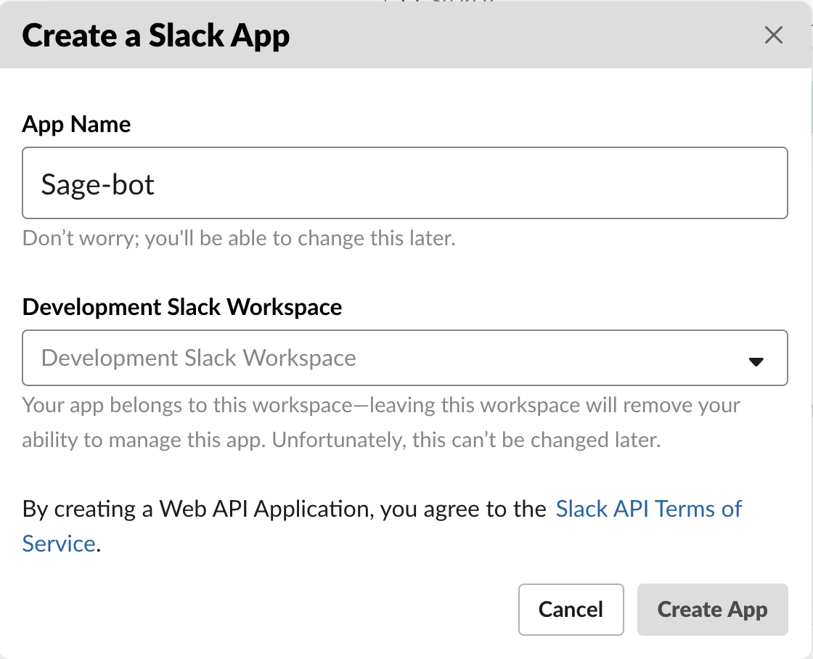
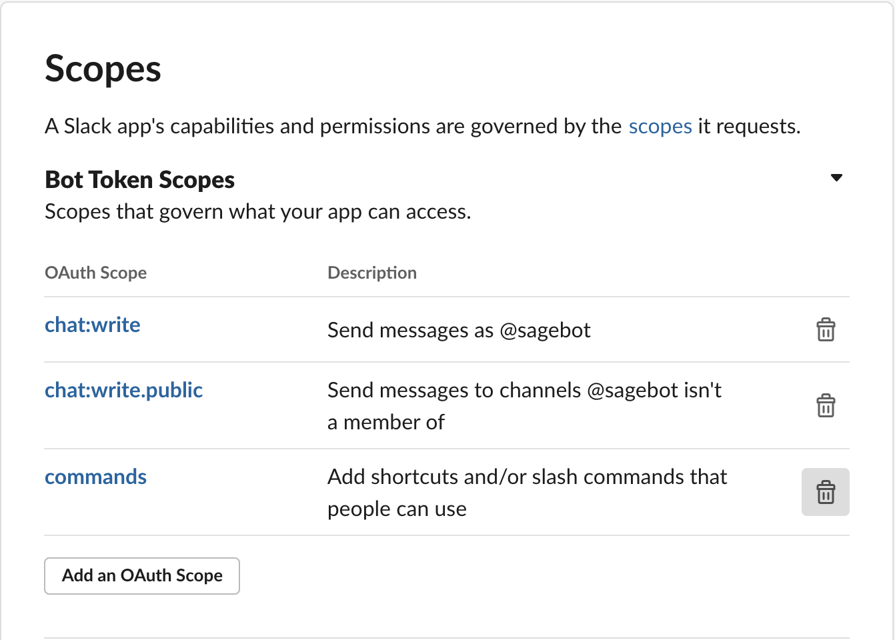
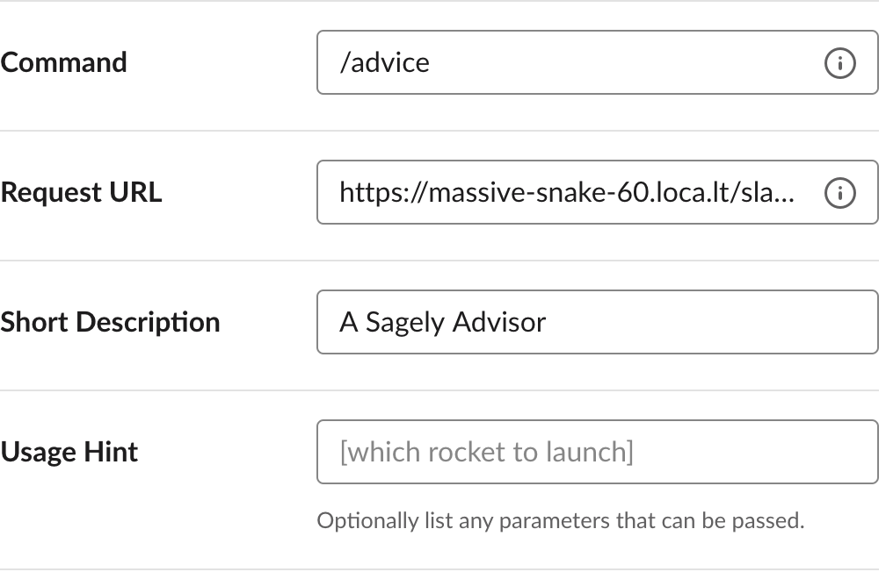
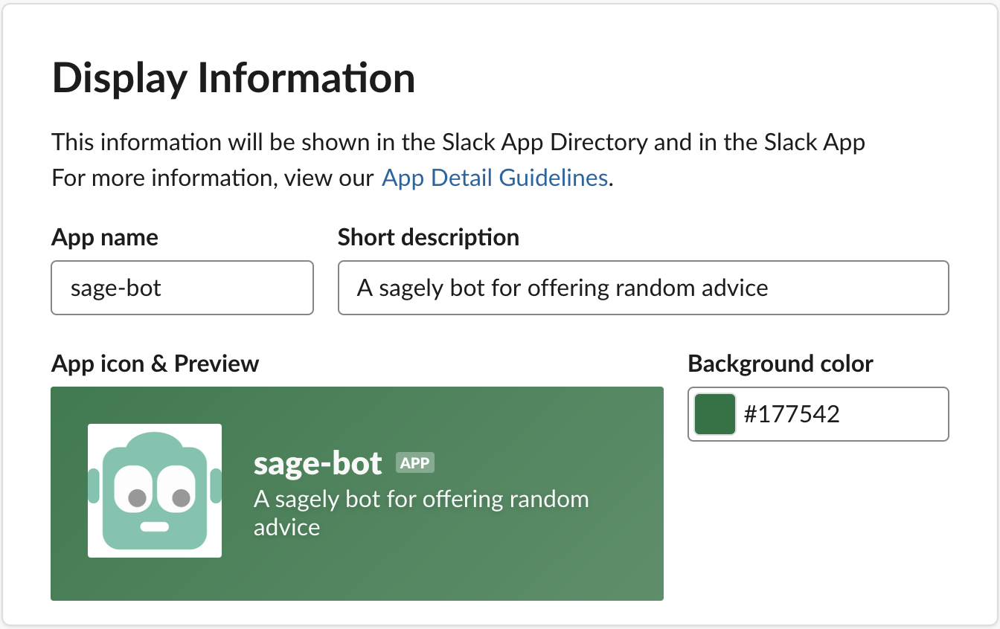
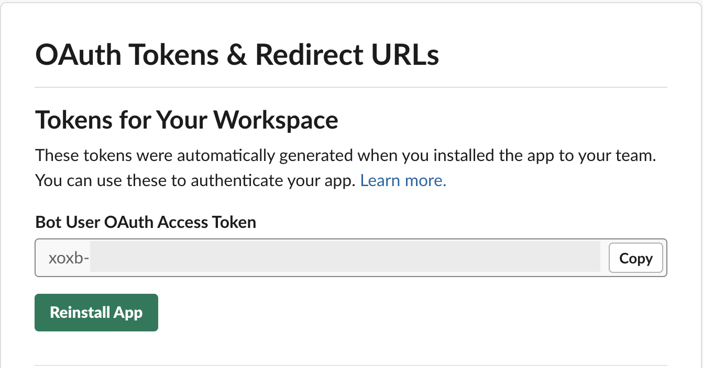
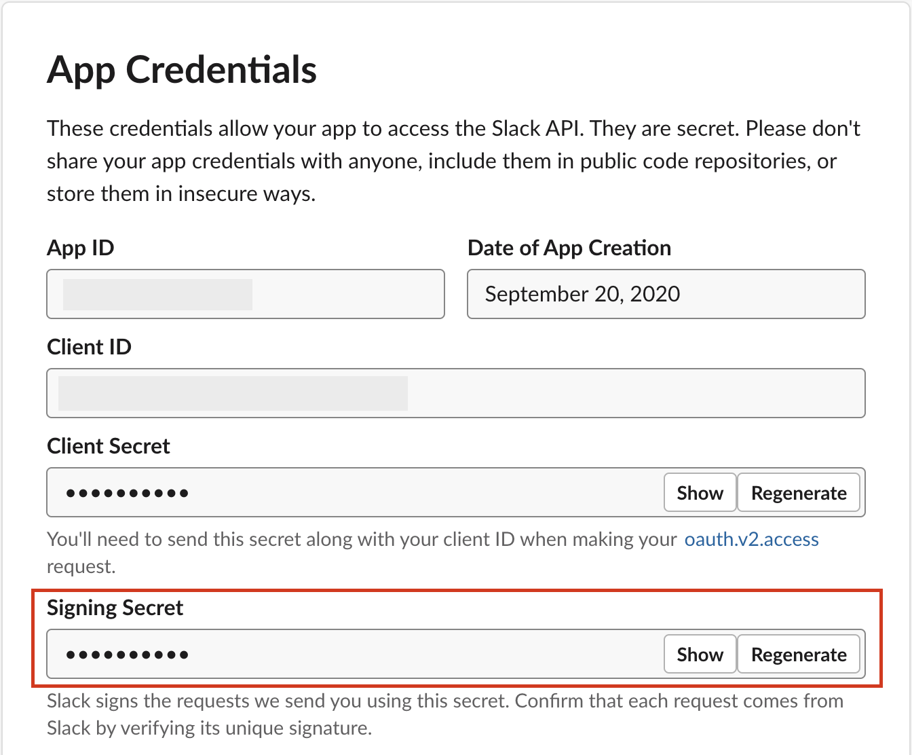
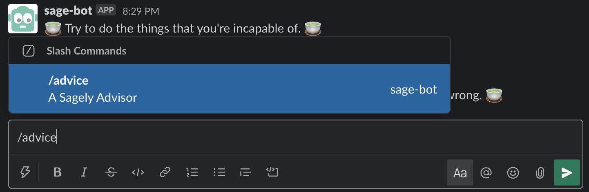

# Getting Started
This documentation has instructions on how to get a very basic bot setup in your local environment. It is by no means complete, but should result in a functioning bot and local development environment.

## Step 1: Install Requirements
Before doing anything else we must clone this repo, and navigate to its parent directory so that we can leverage the boilerplate code that has be written for us.
```
git clone https://github.com/joelsalt/sage-slackbot.git
```

For local development efforts a public url will be needed. The easiest way to do this with the least amount of latency would be to use a tool like ngrock or localtunnel. For these instructions, we will be using localtunnel. Use the command below if you have node installed.
```
npm install -g localtunnel
```

Now that we have the ability to expose our bot using a public url we need to install our bot requirements. We will be using NodeJS to run this bot, and npm to install our dependencies. Once NodeJS is installed please install dependencies.
```
npm i
```

Before we can continue setup we'll need to initialize a `.env` file with the following elements. If you don't have some of these yet thats okay, as we'll be walking through token generation later in this readme.

### .ENV
```bash
TOKEN="xoxb-<YOUR SLACK OAUTH TOKEN>"
SECRET="<YOUR SLACK SIGNING SECRET>"
ADVICE_API=https://api.adviceslip.com/advice
PORT=3000
BOT_NAME=sage-bot
```

## Step 2: Start Slack Bot
To start our bot locally we simply need to run our `npm start` command. Below to ensure that we are running in the environment we installed our requirements on we activate that environment.
```
npm start
```

Our bot is running on port 300 (or whichever port we defined in our `.env` file), so in a new terminal window we need to run localtunnel
```
lt --port <BOT PORT>
```

## Step 3: Bot Creation
Now we need to create our bot on the Slack Platform. We do this by navigating to https://api.slack.com/ and clicking the Start Building Button. We are then prompted to input an App Name that can be changed later, and what Slack organization we want to start our development in. 

<br>

Now that we've got our new bot app, we'll need to add the permissions we're going to use. Navigate to "OAuth and Permissions" and add the following scopes.

<br>

Following the creation of the bot we then want to add slash command functionality to this bot. This allows users to interact with our bot via a predefined slash command. We do this by navigating to the Slash Commands link under Features. After which we will click the Create New Command button. Once we are prompted to enter information for this command we will be using the slash command /advice. The next field is where our localtunnel url comes into play. For the Request URL provide that url in that field. After which provide a Short Description and Usage Hint before submitting the new slash command.

NOTE that the full request url should look like so:
```
https://massive-snake-60.loca.lt/slack/events
```

<br>

Optionally, we can fill out our bot info and add an image.

<br>

## Step 4: Install Slack Bot
Navigate to OAuth & Permissions under the Features navigation menu, and click on the Install App to Workspace button. We'll need to collect the `Bot User OAuth Access Token` and the `Signing Secret` and add them to our `.env`.

<br>
<br>

Finally, we can open slack to our workspace and run the `/advice` command!

<br>